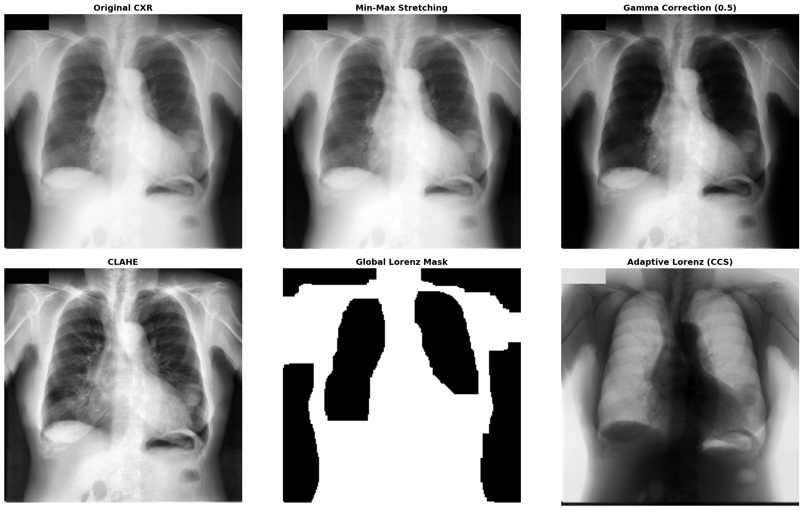

# Chaotic-Contrast-Stretching

An experimental exploration of lung localization and feature enhancement in Chest X-Rays using Lorenz Attractor dynamics.

## Description
Chaotic-Contrast-Stretching (CCS) is a small project exploring how the non-linear dynamics of the Lorenz system can be applied to medical image processing. Instead of using standard intensity mapping, this approach treats pixel values as initial states within a chaotic system to see how they evolve over time.

This project is not a replacement for established clinical methods, but rather an alternative perspective on anatomical localization and detail enhancement through dynamical systems.

## Core Logic
The transformation is based on the simplified z-component of the Lorenz equations:

$$\frac{dz}{dt} = (x \cdot y) - (\beta \cdot z)$$

### Experimental Modes:
- **Global CCS ($x, y$ high):** Acts as a high-gain non-linear limiter. This mode has proven effective for **Body Mask Extraction** by forcing non-zero tissue intensities toward saturation, creating a stable silhouette.
- **Adaptive CCS:** Utilizes local mean statistics to drive the system's parameters. This creates an "inverted-style" enhancement that helps pop out **Pulmonary Vascularity** and fine lung textures.

> **Observation on Parameter Tuning:** Experimental results suggest that with precise parameter calibration, the system is capable of performing a combined **Body + Lung Mask Extraction**. By fine-tuning the attractor's influence, we can isolate the thoracic cavity and internal organs simultaneously, as shown in the comparison results below.

## Comparison with Standard Methods
The following image demonstrates how this chaotic approach performs alongside traditional techniques like CLAHE and Gamma Correction. Notice the specific case where fine-tuned parameters allow for integrated body and lung segmentation:



## Project Structure
- `src/lorenz.py`: Implementation of the chaotic stretching logic.
- `src/utils.py`: Morphological operations for mask refinement and cleaning.
- `src/main.py`: Main pipeline execution script.
- `requirements.txt`: Project dependencies (OpenCV, NumPy, Matplotlib).

## Installation & Usage
1. Clone the repository:
```bash
git clone https://github.com/fae-ld/Chaotic-Contrast-Stretching.git
```
2. Install dependencies:

```Bash

pip install -r requirements.txt
```
3. Run the script: Place your images in the data/ directory and execute:

```Bash
python src/main.py
```

## Current Progress
So far, this method has been tested primarily on the JSRT dataset at a resolution of 224x224. While it shows promising results in isolating anatomical structures without heavy training, it is still sensitive to parameter changes. I am currently looking for ways to automate the parameter selection for diverse datasets.

Feedback, critiques, and suggestions are very welcome!

## License
This project is licensed under the MIT License.